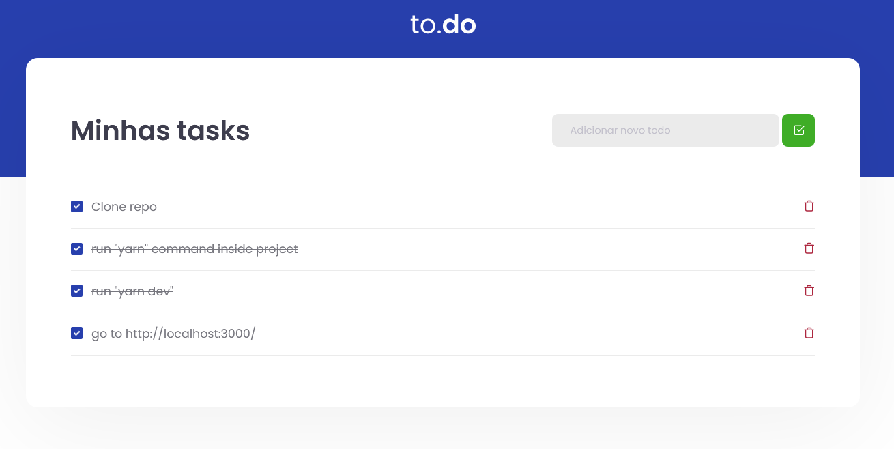

<h1 align="center">
    
</h1>

<h4 align="center">
  The simplest To-Do application you can find.
</h4>
<p align="center">
  

  
  
</p>

<p align="center">
  <a href="#checkered_flag-technologies">Technologies</a>&nbsp;&nbsp;&nbsp;|&nbsp;&nbsp;&nbsp;
  <a href="#information_source-how-to-use">How To Use</a>&nbsp;&nbsp;&nbsp;|&nbsp;&nbsp;&nbsp;
  <a href="#page_facing_up-license">License</a>
</p>

## :checkered_flag: Technologies

- [React JS](https://reactjs.org/)
- [Sass](https://sass-lang.com/)
- [Jest](https://jestjs.io/)
- [testing-library](https://testing-library.com/)
- [VS Code][vc] with [EditorConfig][vceditconfig] and [ESLint][vceslint]

## :information_source: How To Use

In order to run this application, it's required that you have [Git](https://git-scm.com), [Node.js v10.16][nodejs] or higher + [Yarn v1.13][yarn] or higher installed on your computer. From your command line:

**Step 1:** Clone this repo & run a `cd` into project's folder.

**Step 2:** install node modules as below:

```
npm install
```

if you prefer:

```
yarn
```

**Step 3:**

```
yarn dev
```

Once the server is up, go to http://localhost:3000/ and you should see something like this: 
<p align="center">
  
</p>


## :page_facing_up: License

<a href="https://github.com/joao96/the-simplest-todo/blob/main/LICENSE">
    
</a>

<br />

This project is licensed under the MIT.


## Get in touch! :monocle_face:

[](https://www.linkedin.com/in/jvpoletti/)
[](mailto:jvpoletti@gmail.com)

<br />

Made with :green_heart: by [João Victor Poletti](https://github.com/joao96)


[nodejs]: https://nodejs.org/
[yarn]: https://yarnpkg.com/
[vc]: https://code.visualstudio.com/
[vceditconfig]: https://marketplace.visualstudio.com/items?itemName=EditorConfig.EditorConfig
[vceslint]: https://marketplace.visualstudio.com/items?itemName=dbaeumer.vscode-eslint
